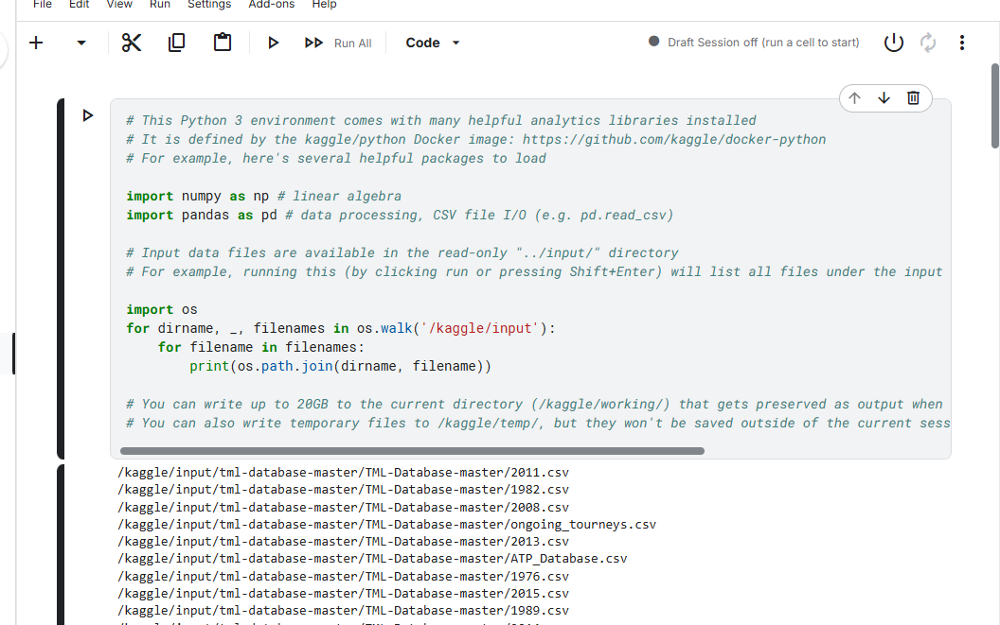
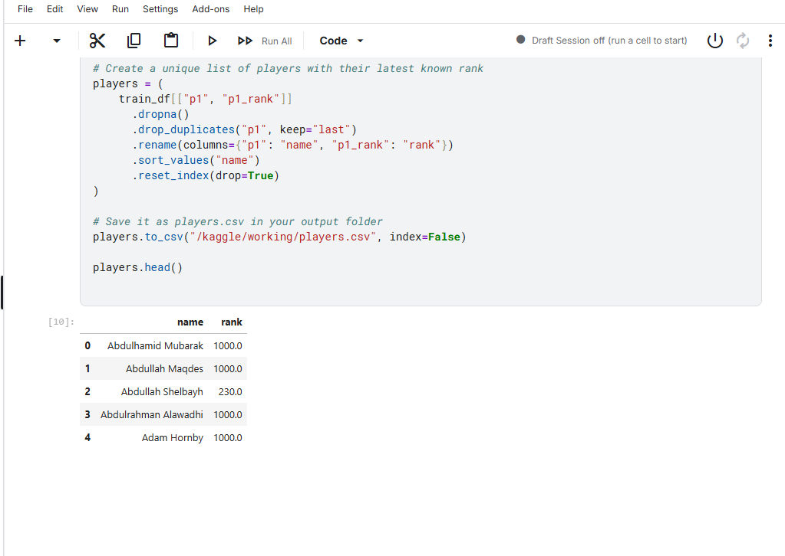
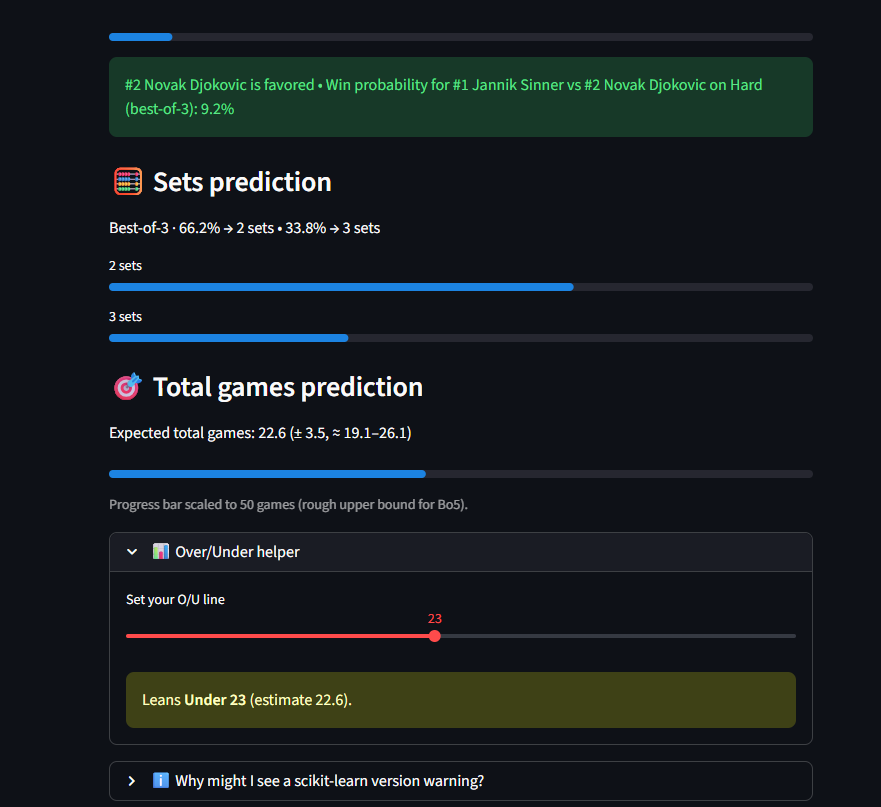

# Tennis Match Analytics & Total Games Prediction

## Project Overview
This project is a Python-based analytics system designed to model and evaluate the expected length of professional tennis matches. The primary focus is predicting **total games played** and **match length (two sets vs three sets)** for best-of-three matches using historical ATP data.

The project emphasizes reproducible modeling, structured evaluation, and deterministic decision logic, treating external benchmarks as reference points for post-event analysis rather than optimization targets.

**Development Note:**  
ChatGPT was used as a supplementary tool to assist with brainstorming, code structuring, documentation drafting, and iterative refinement during development. All modeling decisions, data handling, and evaluation logic were designed and validated by me(Charles).

---
## Exploratory Analysis

The project began with an exploratory data analysis and model validation phase conducted
in a Jupyter notebook. This phase was used to investigate feature relevance, evaluate
model behavior, and analyze prediction error patterns before transitioning to modular
training scripts and an application interface.

A snapshot from the exploratory notebook is shown below.

## Motivation
Match length in tennis is influenced by surface, player skill balance, and historical performance patterns. This project explores how machine learning models can capture those relationships and produce stable, interpretable forecasts for match length metrics.

---

## Data Sources
This project leverages publicly available professional tennis datasets, including:

- **Jeff Sackmann’s Tennis Data**  
  Historical ATP match results, rankings, and metadata used for feature engineering and long-term trend analysis.

- **TML (Tennis Match Log) Database**  
  Match-level datasets providing structured records that complement historical ATP data and support model training and evaluation.

Raw datasets and derived training tables are handled locally and are intentionally excluded from version control.

---

## Data & Feature Engineering
The system incorporates engineered features such as:
- Player ranking and rating differentials
- Surface-adjusted Elo ratings
- Match format indicators
- Historical match-length distributions

Feature definitions and model inputs are modularized to support iterative experimentation.

---

## Modeling Architecture
The project uses ensemble-based machine learning models for different prediction tasks:
- **Total games estimation**
- **Match length classification (two sets vs three sets)**

Separate training pipelines are used for match length and total games modeling, allowing independent evaluation and refinement.

---

## Evaluation Pipeline
Predictions are logged and evaluated after match completion to measure:
- Classification correctness
- Prediction error relative to actual match totals
- Model consistency across confidence levels

Evaluation focuses on analytical accuracy and model behavior rather than external outcomes.

---

## Application Interface
The project includes an interactive application interface used to explore model predictions under different match conditions. Users can select players, surface type, and match format to generate analytics-driven forecasts.

## Example Prediction Output

Below is an example of a model-generated prediction for a professional match, illustrating:

- Match win probability
- Two-set vs three-set likelihood
- Expected total games with uncertainty bounds
- Over/Under classification relative to a benchmark line

---

## Design Principles
- Deterministic inference (no subjective overrides)
- Clear separation between training, prediction, and evaluation
- Emphasis on interpretability and reproducibility
- Modular, experiment-friendly codebase

---

## Disclaimer
This repository is intended for educational and analytical purposes and demonstrates applied machine learning techniques in a sports analytics context.
